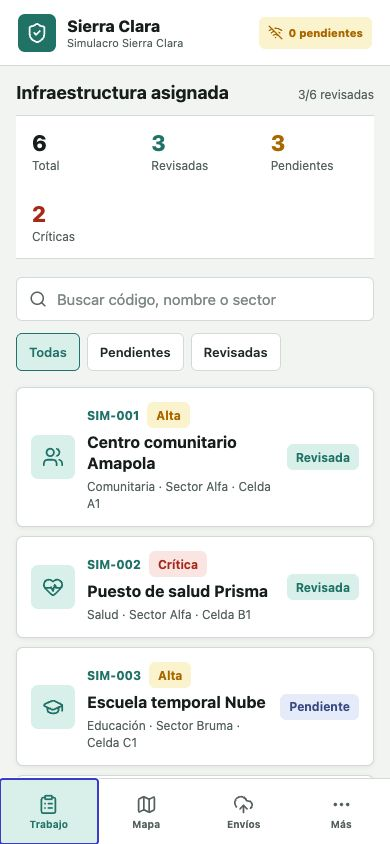
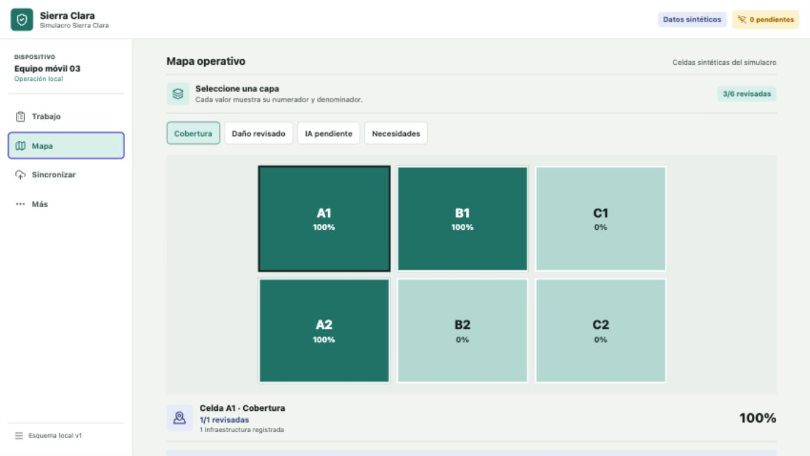

# DNA-84: prueba del prototipo móvil

> **Nota histórica:** este expediente describe el APK base previo a Gemma. La
> evidencia vigente del APK Android con Gemma 4 E2B nativo y prueba sin red está
> en [`CROSS-TASK-HANDOFF.md`](CROSS-TASK-HANDOFF.md).

Validación ejecutada el 2026-08-15 con datos sintéticos.

## Resultado

Sierra Clara abre como aplicación web responsive, mantiene los datos en el
dispositivo y produce una PWA exportable. La prueba recorrió una ficha de
infraestructura, cambió su clasificación manual, consultó la biblioteca local,
guardó la revisión y confirmó su persistencia después de recargar.

## Evidencia visual

### Teléfono, 390 x 844

### Escritorio, 1365 x 768

## Comprobaciones

- 5 pruebas unitarias aprobadas.
- TypeScript estricto sin errores.
- Exportación web de producción completada.
- Manifiesto PWA visible con iconos de 192 y 512 píxeles.
- Cambio de 3/6 a 4/6 inspecciones revisadas después de guardar.
- Persistencia confirmada tras recargar el navegador.
- Capa de cobertura y capa de daño revisado con denominadores independientes.
- Consulta local devolvió una respuesta y su fuente, sin usar un modelo remoto.
- Cola local creó un único cambio idempotente para la inspección editada.

## Límites observados

La cámara y el selector de archivos requieren una prueba manual en un teléfono
físico. No se instaló un paquete ONNX o generativo y la interfaz lo informa sin
fabricar predicciones. La publicación remota requiere volver a autenticar la
cuenta de alojamiento; el build local está listo en `apps/mobile/dist/`.

## Validación incremental del 2026-08-16

Se adaptó el mismo prototipo, preservando la captura de GPS, movimiento,
dispositivo y EXIF, para reducir trabajo y almacenamiento innecesarios:

- La ruta nativa guarda cada imagen como archivo del sandbox y conserva en el
  estado solo URI, tamaño, almacenamiento y SHA-256 de los bytes reales. Se
  construyó Android; iOS no se compiló ni validó.
- GPS y movimiento solo se asocian a una captura de cámara en vivo; una imagen
  importada conserva su procedencia sin atribuirle la ubicación actual.
- La PWA mantiene un fallback inline explícito y limitado a 2,5 MB.
- Un prechequeo de metadatos avisa sobre resolución, proporción o tamaño
  insuficientes sin simular detección de desenfoque o iluminación.
- El almacén migró de esquema v1 a v2 con validación de entrada y conservación
  de evidencia anterior.
- Un asistente determinista prepara borradores, campos faltantes y
  contradicciones sin reservar memoria para un LLM.
- La política de paquetes valida metadatos declarados de memoria,
  almacenamiento y CPU, rechaza artefactos no liberados o sin evaluación y
  preselecciona el candidato compatible de menor costo. No mide por sí sola el
  consumo real ni establece una RAM mínima soportada.
- Las escrituras locales se serializan y una falla de persistencia queda visible
  en la interfaz, en vez de confirmar silenciosamente un guardado inexistente.

Comprobaciones de esta iteración:

- 38 pruebas móviles aprobadas en 11 archivos.
- 42 pruebas Python aprobadas para datos, evaluación y paquetes de modelo.
- TypeScript estricto sin errores.
- `expo-doctor`: 21 de 21 comprobaciones aprobadas.
- Exportación web completada y APK Android `arm64-v8a` construido.
- Verificación visual e interacción a 375, 768 y 1440 px, sin desbordamiento
  horizontal.
- Estado seleccionado expuesto correctamente mediante `aria-checked` y
  `aria-selected` para radios, casillas y navegación.
- La consulta documental y el borrador determinista funcionaron en el navegador
  sin llamadas a un modelo o servidor.
- La partición de demostración produjo 3/3/3 registros por evento sin
  solapamiento; el evaluador detecta IDs faltantes, extra o duplicados y solo
  considera completa una evaluación atada a hashes de modelo, predicciones y
  manifiesto sellado. El placeholder permaneció `released: false`.
- El empaquetador rechazó un reporte de evaluación incompleto sin dejar un
  directorio parcial y exige que la métrica declarada coincida con el reporte.

Evidencia del APK local de prueba:

- ruta: `apps/mobile/android/app/build/outputs/apk/release/app-release.apk`;
- tamaño: 30.200.904 bytes;
- SHA-256: `8347be1f058c55d78a9a001ca07ecd2b679703ae11ffef900999d6a28c5628d3`;
- paquete `co.sierraclara.campo`, `minSdk 24`, `targetSdk 36`, solo
  `arm64-v8a`;
- incluye el módulo local Android `CaptureQualityProxy`; no incluye `.onnx` ni
  `.litertlm` y no solicita `INTERNET`, `RECORD_AUDIO` o
  `SYSTEM_ALERT_WINDOW`;
- la firma es **Android Debug**: sirve para instalación local, no para
  distribución.

El APK se instaló en un emulador Android API 35 ARM64. El primer arranque en frío
de `MainActivity` terminó `ok` en 6.037 ms. Después, con modo avión activado y
`Active default network: none`, otro arranque con proceso frío terminó `ok` en
1.388 ms; un snapshot posterior mostró PSS de 83.707 KB, RSS de 211.784 KB y
cero swap. Son observaciones puntuales del emulador, no picos, benchmark físico
ni promesa de consumo mínimo.

En esa sesión sin red se importó una imagen. La app la persistió como archivo,
verificó su integridad y el módulo Kotlin devolvió una medición del proxy local
sin modelo. La captura de pantalla y el registro de hashes están en
[`docs/evidence/android-local-build-v1.json`](evidence/android-local-build-v1.json).
Esto prueba un camino nominal en API 35, no la matriz física de EXIF, codecs,
versiones Android, memoria pico o fabricantes.

La exportación JSON es `restricted-reduced-manifest-v1`: omite fotos, URI,
coordenadas exactas, notas libres, EXIF y salida de modelo, pero conserva IDs,
horas, hashes, conteos, necesidades, anotaciones, alias de dispositivo y cola.
No es pública, anónima ni segura por sí sola; exige receptor autorizado y canal
cifrado aprobado.

La auditoría de dependencias reporta 18 entradas (7 moderadas y 11 altas),
derivadas de tres cadenas transitivas de herramientas (`image-size`, `uuid` y
sus consumidores Expo/Metro). La corrección automática propone cambios mayores
incompatibles, incluso una reducción de versión de Expo/React Native, por lo que
no se aplicó. Este punto sigue abierto como puerta de release.

El flujo de archivos nativos todavía necesita una prueba instrumentada en la
matriz de teléfonos físicos. El proxy de píxeles es Android-only; iOS queda
pendiente. No se ha validado ni distribuido un paquete ONNX. Gemma 4 E2B sí se
integró después en la PWA y se probó en un Chrome de escritorio: revisión y
SHA-256 exactos, carga desde OPFS con LiteRT-LM/WebGPU y generación de 6,8 s con
el servidor devolviendo 404 y cero solicitudes durante la inferencia. Esa
evidencia está en
[`docs/evidence/gemma-e2b-web-v1.json`](evidence/gemma-e2b-web-v1.json); no
equivale a compatibilidad, RAM mínima, batería o térmica en teléfonos físicos.
