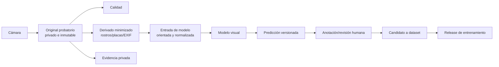

# IA local, datos de entrenamiento y mapas de afectación

- Estado: `Proposed`
- Alcance: extensión técnica de DNA-81
- Revisión requerida: F1 Gobierno/campo, F2 Móvil/IA y F3 Datos/web

## Resultado buscado

La aplicación se presenta con la identidad del proyecto y un `Asistente local`.
El personal de campo no necesita conocer el proveedor, formato o runtime para
completar una inspección. La procedencia y licencias de componentes se conservan
en `Más > Información técnica > Licencias`, en los artefactos distribuidos y en
el repositorio.

Ocultar complejidad es parte del producto. Borrar avisos, atribuciones o
metadatos para atribuirse un modelo de terceros no lo es. Gemma 4 usa Apache 2.0:
permite una aplicación de marca propia, pero al redistribuir exige conservar la
licencia, avisos aplicables y señalar modificaciones.

Tampoco se oculta que una sugerencia fue generada por IA. La marca del proveedor
puede quedar fuera del flujo diario, pero la fuente `IA`, la versión del modelo y
la revisión humana deben ser visibles cuando influyen en una decisión.

## Qué significa una IA experta

No se entrenará un único modelo para responder todo. La especialización se
construye con cuatro componentes verificables:

| Componente | Función | Tecnología propuesta |
|---|---|---|
| Reglas | campos, autoridad, coherencia y estados permitidos | validadores deterministas versionados |
| Visión | calidad de foto y daños visibles | MobileNetV3/LR-ASPP ONNX y modelos posteriores |
| Conocimiento | leyes, guías, formularios y procedimientos vigentes | RAG local con documentos aprobados y fuente visible |
| Asistente | diálogo, resumen y herramientas locales | Gemma 4 E2B/E4B mediante LiteRT-LM |

La conclusión profesional sigue siendo una entidad distinta. Ni la máscara de
visión ni el texto del asistente pueden firmarla, publicarla o convertirla en
clasificación oficial.

## Distribución de un toque

### Paquete base

La instalación inicial contiene:

- interfaz, formularios y validadores;
- SQLite/SQLCipher y sincronización;
- cámara, mapa y control de calidad liviano;
- modelo visual pequeño aprobado;
- modo totalmente funcional sin LLM.

### Paquetes opcionales

Después del enrolamiento, la aplicación prueba memoria, almacenamiento,
temperatura y aceleradores. Por Wi-Fi puede descargar:

| Perfil | Paquete | Uso |
|---|---|---|
| Universal | sin LLM | captura, reglas, mapa e IA visual pequeña |
| Intermedio | Gemma 4 E2B móvil | ayuda textual/RAG y tareas breves |
| Alto | Gemma 4 E4B móvil | imágenes, audio, razonamiento y herramientas locales |

E4B no se instala por defecto: los 2,5 GB publicados corresponden a memoria
aproximada de carga móvil de pesos; el runtime, el contexto, cámara, mapa y base
de datos requieren memoria adicional. El paquete se descarga a un área temporal,
se verifica por firma y hash, se activa atómicamente y conserva reversión.

### Marca e interfaz

El código utiliza interfaces neutrales:

```text
LocalAssistantEngine
VisionSegmentationEngine
KnowledgeRetriever
ModelPackManager
```

La pantalla diaria dice `Asistente local`, `Análisis visual` y `Modelo
disponible`. El diagnóstico técnico muestra motor, versión, hash, licencia y
origen para soporte y auditoría. La aplicación no usa marcas de terceros como
nombre del producto ni sugiere patrocinio.

## Arquitectura de almacenamiento



### Regla de evidencia

El original no se recorta, pinta, redimensiona ni reescribe. Se guarda en el
directorio privado y se identifica por SHA-256. Rotación visual, corrección de
orientación, reducción, anonimización y máscaras producen derivados nuevos con:

- `parent_media_id` y `parent_sha256`;
- versión de la transformación;
- parámetros aplicados;
- autor o proceso;
- fecha y motivo;
- nuevo hash y tamaño.

La superposición de IA nunca sustituye la foto. Un PDF puede mostrarla como capa
separada y debe permitir regresar al original.

### Tablas mínimas

| Tabla | Responsabilidad |
|---|---|
| `media` | original o derivado, hashes, ruta, MIME, tamaño y estado de sync |
| `media_transform` | genealogía y parámetros de cada transformación |
| `quality_assessment` | enfoque, exposición, obstrucción y decisión humana |
| `taxonomy_version` | versión aprobada de clases, relaciones y definiciones |
| `label_definition` | código estable, nombre, descripción y autoridad |
| `annotation` | objeto anotado, geometría, fuente y estado de revisión |
| `annotation_label` | varias etiquetas por anotación o imagen |
| `ai_prediction` | modelo, entrada, salida, umbral y rendimiento |
| `human_review` | aceptó, corrigió, descartó, motivo y credencial |
| `training_consent` | fundamento/finalidad para usar el derivado en entrenamiento |
| `dataset_item` | inclusión/exclusión, partición y release |
| `dataset_release` | manifiesto inmutable, hashes, licencia y estadísticas |
| `knowledge_document` | norma/guía aprobada, versión, vigencia y autoridad |
| `knowledge_chunk` | fragmento recuperable con referencia exacta |
| `model_release` | artefacto, métricas, límites, firma y compatibilidad |

Fotos, nombres de personas y blobs grandes no se guardan dentro de filas SQLite.
SQLite conserva referencias privadas; el almacenamiento de archivos conserva los
bytes. En servidor, PostgreSQL/PostGIS mantiene relaciones y objetos privados
mantiene originales/derivados.

## Taxonomía multieje

Una `clase` plana no representa una inspección. La taxonomía combina ejes y cada
eje tiene código, definición, versión, ejemplos positivos y contraejemplos.

### Evento o amenaza

- sismo;
- inundación;
- movimiento en masa;
- avenida torrencial;
- vendaval/tormenta;
- incendio;
- actividad volcánica;
- otro definido por autoridad.

El evento no se infiere únicamente de la foto. Llega del contexto operativo.

### Tipo de infraestructura

- vivienda/edificación;
- salud;
- educación;
- puente;
- vía;
- agua y saneamiento;
- energía;
- telecomunicaciones;
- instalación de respuesta;
- infraestructura productiva;
- otra tipología aprobada.

### Elemento observado

- terreno/cimentación visible;
- columna/pilar;
- viga;
- muro estructural;
- muro no estructural/fachada;
- losa/piso;
- cubierta;
- escalera;
- junta/conexión;
- contención/talud;
- componente de servicio.

### Condición visual candidata

- grieta/fisura visible;
- desprendimiento o pérdida de material;
- acero expuesto/corrosión visible;
- aplastamiento;
- pandeo/deformación;
- desplazamiento o separación;
- asentamiento/inclinación aparente;
- humedad/socavación/erosión;
- caída de componente no estructural;
- colapso parcial/total observado;
- peligro de servicio visible;
- sin condición de la taxonomía;
- fuera de dominio.

Estos nombres describen evidencia visual, no causalidad ni habitabilidad. La
clasificación profesional del formulario IDIGER/UNGRD se conserva en otra capa y
sólo la completa una persona autorizada.

### Calidad y observabilidad

- observado;
- no observado;
- no accesible;
- desconocido;
- no aplica;
- ocluido;
- desenfocado;
- sin escala;
- fuera de dominio.

### Vista y escala

- contexto, fachada, elemento, detalle, terreno o servicio;
- escala ausente, referencia física aprobada o instrumento;
- método y unidad de medición;
- precisión estimada y limitaciones.

Una foto puede tener muchas anotaciones. Cada daño segmentado tiene polígono o
máscara, elemento, condición y estado de revisión. La severidad estructural no se
deduce del área de píxeles.

### Ejemplo canónico

```json
{
  "taxonomy_version": "damage-taxonomy/0.1",
  "media_sha256": "...",
  "event_type": "earthquake",
  "infrastructure_type": "building",
  "annotations": [
    {
      "element": "masonry_wall",
      "visual_condition": "visible_crack",
      "geometry_type": "polygon",
      "visibility": "observed",
      "scale_method": "physical_reference",
      "source": "human",
      "review_status": "adjudicated"
    }
  ]
}
```

## Ciclo de una fotografía

1. **Captura:** original, orientación, hora, ubicación con precisión y tipo de
   vista. EXIF sensible no se copia a galerías públicas.
2. **Calidad:** algoritmos locales miden luz/enfoque; la persona repite o
   justifica.
3. **Minimización:** se crea derivado de entrenamiento sin metadatos innecesarios
   y con rostros/placas ocultos cuando corresponda.
4. **Normalización:** recorte o mosaicos fijos, color/orientación y parámetros
   reproducibles.
5. **Predicción:** máscara/clase candidata con modelo, hash y umbral.
6. **Revisión:** inspector acepta, corrige o descarta; no se autoetiqueta como
   verdad.
7. **Sincronización:** original privado y derivados se envían según finalidad y
   prioridad.
8. **Selección:** sólo una copia con fundamento de uso, calidad y revisión puede
   entrar al dataset.
9. **Retención:** evidencia y material de entrenamiento tienen políticas
   diferentes; retirar uno no altera silenciosamente el otro.

## Dataset central y entrenamiento

El teléfono hace inferencia y captura. El entrenamiento ocurre en un entorno
central reproducible, con cómputo, control de acceso y revisión. Entrenar en cada
teléfono fragmentaría la verdad, consumiría batería y permitiría contaminación o
envenenamiento del modelo.

### Zonas de datos

| Zona | Contenido | Acceso |
|---|---|---|
| Evidencia | originales privados y cadena de custodia | inspectores/revisores autorizados |
| Cuarentena | nuevos datos sin validar | equipo de datos restringido |
| Etiquetado | derivados minimizados y guía de anotación | anotadores autorizados |
| Dataset | release inmutable y adjudicado | entrenamiento/auditoría |
| Evaluación | conjunto oculto por territorio/evento | evaluador independiente |
| Registro de modelos | modelo, métricas, ficha, firma y rollback | publicación controlada |

### Producción de un release

1. comprobar finalidad, autorización o fundamento legal;
2. eliminar duplicados exactos y casi duplicados sin borrar evidencia;
3. validar calidad, tipología, evento y cobertura territorial;
4. minimizar y separar identificadores personales;
5. anotar con guía versionada;
6. hacer doble revisión en clases críticas y adjudicar desacuerdos;
7. dividir por infraestructura, evento y territorio, nunca fotos aleatorias del
   mismo edificio entre entrenamiento y prueba;
8. congelar archivos, etiquetas, hashes y estadísticas en un manifiesto;
9. entrenar desde configuración versionada;
10. evaluar calidad, sesgo, memoria, batería, latencia y seguridad;
11. aprobar, firmar y publicar el paquete; o rechazar con motivo.

Un `dataset_release` no cambia. Una corrección produce otro release y permite
reproducir modelos anteriores.

### Estrategia de modelos

#### Visión especializada

Primer modelo: segmentación semántica `fondo / posible grieta` con LR-ASPP
MobileNetV3. Crack-Seg es semilla, no dataset final. Se agregan casos negativos,
materiales, iluminación, dispositivos, tipologías y territorio local.

Luego se entrenan modelos separados cuando existan suficientes ejemplos
adjudicados:

- calidad de captura;
- grietas y fisuras visibles;
- desprendimiento/acero expuesto;
- deformación, separación o colapso visible;
- infraestructura/elemento para enrutar el formulario;
- detección fuera de dominio.

No se agregan clases sólo porque el formulario tenga un campo. Cada clase exige
definición observable, volumen mínimo, acuerdo entre expertos y prueba externa.

#### Asistente generativo

La primera especialización de Gemma 4 no es reentrenar todos sus pesos. Se usa:

1. prompt del sistema versionado con límites y rol;
2. RAG local sobre documentos aprobados;
3. herramientas que consultan SQLite y validadores;
4. salidas JSON contra esquema;
5. confirmación humana antes de insertar un borrador.

Después de medir errores puede aplicarse LoRA/SFT para formato, vocabulario y
preguntas operativas. No se ajusta para inventar decisiones estructurales a partir
de fotos. Los ejemplos de entrenamiento deben incluir rechazos, incertidumbre,
falta de autoridad y citas correctas.

### Base de conocimiento local

Cada documento se incorpora con:

- autoridad y URL/archivo fuente;
- título, versión, fecha, territorio y vigencia;
- hash y licencia/permiso;
- secciones y fragmentos citables;
- fecha de revisión y responsable;
- estado activo, vencido o sustituido.

La recuperación prioriza territorio, tipo de evento, rol y versión de formulario.
La respuesta muestra título/sección, diferencia norma de recomendación y declara
cuando no encuentra sustento. Un documento nuevo no reemplaza una versión activa
hasta que una persona lo apruebe.

### Herramientas del asistente

Gemma puede invocar funciones locales con argumentos validados:

- `buscar_norma(consulta, territorio, fecha)`;
- `listar_campos_faltantes(inspection_id)`;
- `resumir_observaciones(inspection_id)`;
- `consultar_infraestructura(infrastructure_id)`;
- `proponer_borrador_observacion(media_id)`;
- `calcular_pendientes_sync(event_id)`.

No recibe herramientas para sellar, aprobar, borrar originales, publicar mapas o
modificar permisos. Sus llamadas y resultados quedan auditados.

## Mapas de calor y afectación

Un mapa de puntos rojos engaña si sólo refleja dónde trabajaron más inspectores.
Se publican capas distintas y siempre se muestra denominador, fecha y fuente.

### Capas privadas operativas

| Capa | Métrica | Fuente |
|---|---|---|
| Cobertura | inspeccionadas / asignadas | registros confirmados |
| Afectación observada | con condición revisada / inspeccionadas elegibles | revisión humana |
| Intensidad | suma ponderada aprobada / inspeccionadas | taxonomía y autoridad |
| Pendientes IA | sugerencias sin revisar por celda | modelo, capa separada |
| Infraestructura crítica | banderas y estado operativo | autoridad sectorial |
| Necesidades humanas | agregados con umbral de privacidad | dominio humanitario separado |

La fórmula inicial evita mezclar cobertura y daño:

```text
cobertura = inspecciones_confirmadas / infraestructuras_asignadas
tasa_afectacion = infraestructuras_con_dano_revisado / inspecciones_elegibles
pendiente_ia = sugerencias_no_revisadas
```

`pendiente_ia` nunca se suma a `tasa_afectacion`. Una ponderación de intensidad
debe ser aprobada y versionada; no se toma directamente de la confianza del
modelo.

### Agregación espacial

PostGIS genera cuadrículas hexagonales por escala y cruza inspecciones por tiempo,
evento y territorio. La API devuelve GeoJSON agregado; MapLibre representa color,
opacidad y leyenda. Cada celda incluye:

- número inspeccionado y universo conocido;
- tasa, no sólo conteo;
- período de observación;
- proporción revisada y fuente;
- tamaño de celda y regla de supresión;
- versión de taxonomía/formulario/modelo.

La consola privada puede bajar de escala según rol. El mapa público usa celdas
mayores, redondeo y supresión cuando el grupo sea menor al umbral aprobado. No
publica hogares, personas, fotos, coordenadas exactas ni predicciones sin revisar.

### Evitar conclusiones falsas

- Una celda sin inspecciones se muestra `sin datos`, no verde.
- Una celda con una visita no se compara como si tuviera muestra suficiente.
- El color no es la única señal; se muestran valor y denominador.
- Cambios de formulario/taxonomía se filtran o normalizan explícitamente.
- El usuario puede separar evento, día, tipo de infraestructura y fuente.
- El mapa conserva acceso hasta la inspección original sólo para roles privados.

## Minimización y privacidad

- Identidad de personas/hogares se mantiene fuera de la base técnica.
- Fotos no se usan para entrenamiento por defecto; cada finalidad se registra.
- Rostros, placas, documentos y pantallas se detectan para revisión y se ocultan
  en derivados de entrenamiento/publicación.
- No se implementa reconocimiento facial ni inferencia de identidad.
- GPS exacto se restringe; mapas externos reciben agregados.
- El asistente no indexa nombres, teléfonos ni notas humanas sensibles salvo que
  exista necesidad, autoridad y diseño separado.
- Logs y telemetría excluyen prompts, imágenes y coordenadas por defecto.
- Retiro, corrección, retención y revocación se propagan a futuros releases sin
  destruir la cadena de auditoría permitida.
- Toda exportación queda cifrada, con finalidad, destinatario y vencimiento.

La SIC exige privacidad desde el diseño, acceso restringido y medidas demostrables
antes de poner en funcionamiento sistemas que contienen datos privados o
sensibles. Esta arquitectura debe pasar una evaluación de impacto de privacidad
antes del piloto con personas reales.

## Puertas de aprobación

### Taxonomía

- Aprobada por ingeniería estructural, gestión del riesgo y datos.
- Alineada con formulario IDIGER/UNGRD sin convertir IA en autoridad.
- Guía de anotación probada con acuerdo entre revisores.

### Dataset

- Finalidad, procedencia, licencia y fundamento documentados.
- Sin fuga entre infraestructura/evento en train/val/test.
- Cobertura y vacíos publicados por territorio, dispositivo y tipología.
- Conjunto de evaluación independiente y congelado.

### Modelo visual

- Métricas por clase y falsos negativos críticos.
- Prueba fuera de dominio y calibración.
- Latencia, memoria, batería y temperatura en teléfonos piloto.
- Resultado siempre editable/rechazable por una persona.

### Asistente

- Responde con fuentes locales y reconoce ausencia de evidencia.
- Salida estructurada pasa validadores o se descarta.
- No puede aprobar, firmar, publicar ni borrar.
- Prompt injection desde documentos/fotos se prueba y contiene.
- Modelo y licencia incluidos en avisos de terceros.

### Mapas

- Cobertura, daño revisado e IA pendiente son capas diferentes.
- Denominador, período, tamaño de celda y supresión son visibles.
- No hay datos personales o coordenadas sensibles en publicación.
- Totales se reconcilian hasta registros autorizados.

## Fuentes de diseño

- [Gemma 4: capacidades, memoria y modelos móviles](https://ai.google.dev/gemma/docs/core)
- [Gemma 4: licencia Apache 2.0](https://ai.google.dev/gemma/apache_2)
- [LiteRT-LM para Android, iOS, web y escritorio](https://developers.google.com/edge/litert-lm)
- [Formulario IDIGER de inspección después de un sismo](https://www.idiger.gov.co/documents/233481/262331/Formulario%2BV2F.pdf/fd60b2eb-4a5f-411d-94ae-46c0c3be853c)
- [UNGRD: EDAN y ayuda humanitaria](https://portal.gestiondelriesgo.gov.co/Documents/Manejo/Estandarizaci%C3%B3n-Ayuda-humanitaria-Colombia.pdf)
- [PostGIS ST_HexagonGrid](https://postgis.net/docs/manual-dev/en/ST_HexagonGrid.html)
- [MapLibre: especificación de capas](https://maplibre.org/maplibre-style-spec/layers/)
- [Ley 1581 de 2012](https://www.funcionpublica.gov.co/eva/gestornormativo/norma.php?i=49981)
- [SIC: privacidad desde el diseño](https://www.sic.gov.co/boletin/juridico/habeas-data/privacidad-desde-el-dise%C3%B1o-es-indispensable-para-proteger-los-derechos-de-las-personas)
