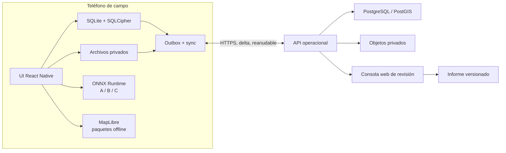
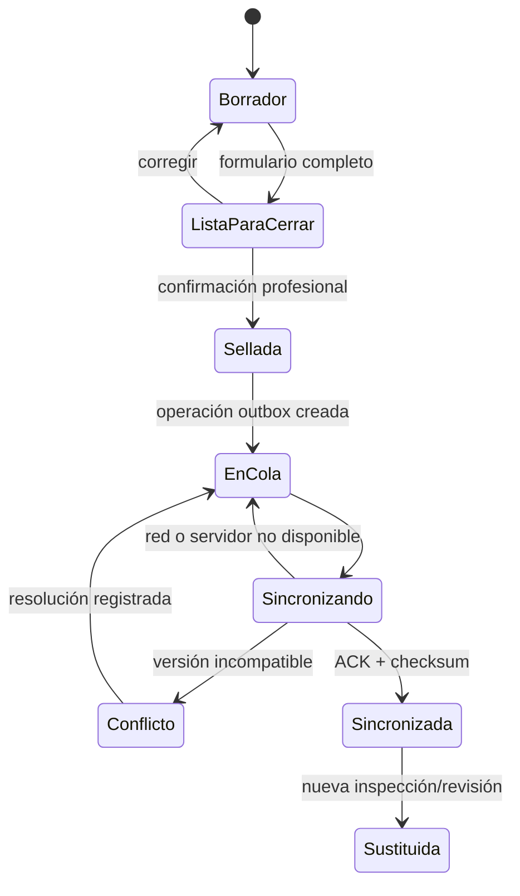
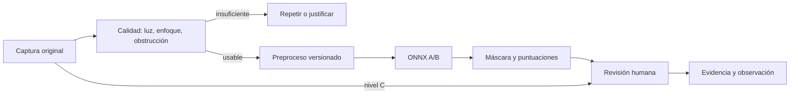
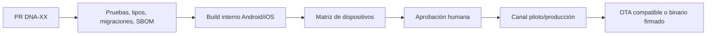

# Arquitectura móvil de campo

Esta especificación desarrolla la propuesta [DNA-81](decisions/DNA-81-mobile-runtime-local-ai.md).
No sustituye la aprobación humana de autoridad, esquema, privacidad o licencias.

## Objetivo operativo

Un teléfono debe poder descargar una misión, trabajar durante horas o días sin
red, registrar muchas infraestructuras, conservar evidencia, ejecutar asistencia
visual cuando sea seguro y sincronizar sin pérdida al recuperar conectividad.

La unidad de trabajo no es una foto aislada. Es una inspección versionada que
vincula evento, infraestructura, asignación, observaciones, medios, sugerencias
de IA, revisión humana y acciones autorizadas.

## Vista del sistema



No hay flecha desde un modelo hacia una decisión oficial. Toda sugerencia debe
pasar por el formulario y la autoridad humana definida en DNA-58.

## Módulos del teléfono

| Módulo | Responsabilidad | Falla segura |
|---|---|---|
| Sesión y dispositivo | enrolamiento, rol, evento y bloqueo local | modo bloqueado; no borra datos pendientes |
| Paquete de misión | formulario, catálogo, mapa, reglas y modelo | conserva última versión válida y muestra vigencia |
| Infraestructuras | búsqueda, lista, mapa, asignación y alta controlada | permite borrador con posible duplicado marcado |
| Inspección | formulario versionado y estados explícitos | guarda cada paso localmente |
| Cámara | original, contexto/detalle, escala, calidad y hash | captura manual aunque la IA no esté disponible |
| IA asistiva | control de calidad y anomalías visibles | nivel C, sin inferencia |
| Persistencia | transacciones, migraciones, índices y auditoría | migración aborta y conserva copia válida |
| Sincronización | pull delta, outbox, medios y conflictos | reintenta sin duplicar y no sobrescribe decisiones |
| Diagnóstico del equipo | almacenamiento, modelo, red, batería y versión | bloquea sólo descargas/inferencia costosa |

## Datos locales

### Entidades mínimas

| Entidad | Propósito | Campos críticos |
|---|---|---|
| `event` | sismo/simulacro y autoridad | id, nombre, modo, territorio, vigencia |
| `mission_pack` | versión operativa descargada | esquema, reglas, mapa, modelo, firma, expiración |
| `device` | enrolamiento y capacidad | id público, perfil, versión, último contacto |
| `assignment` | trabajo asignado al inspector | evento, zona, prioridad, responsable, estado |
| `infrastructure` | activo o inmueble | tipo, geometría, dirección, identificadores fuente |
| `inspection` | visita o evaluación versionada | formulario, alcance, inspector, estado, sello |
| `observation` | condición observada | elemento, daño, severidad, incertidumbre, acción |
| `media` | evidencia y derivados | hash, ruta, tamaño, vista, escala, GPS, estado |
| `ai_run` | sugerencia reproducible | modelo, hash, entrada, salida, tiempo, dispositivo |
| `review` | aceptación/corrección humana | revisor, decisión, motivo, versión base |
| `human_case` | referencia privada a hogar/persona | identificador seudónimo y acceso separado |
| `outbox` | operación pendiente | tipo, entidad, versión, idempotencia, intento |
| `sync_cursor` | punto confirmado por servidor | evento, colección, cursor, fecha |
| `audit_event` | trazabilidad local | actor, acción, objeto, antes/después, hora |

Los identificadores se generan en el teléfono y son globalmente únicos. Una
referencia de infraestructura externa no se usa como clave primaria porque puede
cambiar o no existir. Las fechas conservan hora del dispositivo, zona horaria y,
cuando exista, hora confirmada por servidor.

### Separación de dominios

- `infrastructure` no contiene nombres de habitantes.
- `human_case` usa tablas, permisos, exportaciones y retención separados.
- una alerta de búsqueda/rescate crea una derivación operativa; la IA visual de
  grietas no detecta ni infiere personas atrapadas;
- la vista pública consume artefactos aprobados, nunca la base móvil ni los
  originales directamente.

### Índices y escala

La aplicación no carga el evento completo en memoria. Se requieren índices por:

- evento, zona, estado, prioridad y responsable;
- identificador externo y texto normalizado;
- geometría simplificada o índice espacial disponible;
- fecha de actualización y estado de sincronización;
- hash de medio e idempotency key.

Las listas usan paginación por cursor y renderizado virtual. El mapa agrupa
puntos y consulta por ventana visible. Las miniaturas se cargan bajo demanda.
La prueba base debe incluir 10.000 infraestructuras de catálogo y, como mínimo,
20 inspecciones completas consecutivas en el teléfono de entrada del piloto.
Este número es un objetivo de prueba, no un límite funcional publicado.

## Archivos y presupuesto de almacenamiento

Los originales viven en el directorio privado de la app y son inmutables. Cada
captura produce, según necesidad:

```text
original -> hash -> miniatura -> entrada normalizada para IA -> máscara/overlay
```

El original no se reemplaza por la versión comprimida ni por la imagen pintada
por la IA. Los derivados registran el hash del padre y la versión del proceso.

### Reglas de espacio

1. Antes de descargar mapa o modelo se muestra tamaño, vigencia y espacio final.
2. Cada evento tiene una cuota configurable y reserva espacio para formularios.
3. Con poco espacio se detienen modelos/mapas nuevos y procesamiento derivado;
   continúa captura textual y sincronización de metadatos.
4. Los originales pendientes nunca se purgan automáticamente.
5. Tras ACK, checksum y política aprobada se puede purgar una copia local,
   conservando metadatos, hash y miniatura cuando esté permitido.
6. El usuario ve qué ocupa espacio: originales, mapas, modelos, derivados y
   elementos ya respaldados.

## Estado de una inspección



Una inspección sellada no se edita en sitio. Una corrección crea una nueva
versión enlazada y conserva la anterior.

## Protocolo de sincronización

### Escritura local

En una transacción exclusiva:

1. validar la mutación contra la versión de esquema;
2. escribir entidad y versión;
3. anexar auditoría;
4. crear outbox con idempotency key estable;
5. confirmar la transacción.

Si el proceso se interrumpe antes del commit, ni la entidad ni la outbox quedan
a medias. Si ocurre después, el reintento usa la misma clave.

### Orden de envío

1. identidad operativa y manifiestos requeridos;
2. inspecciones, observaciones y alertas;
3. miniaturas y metadatos de medios;
4. originales por partes reanudables;
5. telemetría técnica sin datos sensibles innecesarios.

Cada parte se verifica por tamaño y hash. El servidor confirma el resultado
canónico y entrega un cursor. La pérdida de red sólo cambia el estado de cola.

### Conflictos

| Conflicto | Tratamiento |
|---|---|
| Dos ediciones de dato descriptivo no sellado | combinación por campo si no hay colisión |
| Dos conclusiones o acciones incompatibles | revisión explícita, sin último escritor |
| Infraestructura duplicada | posible coincidencia; conservar ambos orígenes hasta resolver |
| Inspección sellada modificada | nueva versión/sustitución, nunca edición destructiva |
| Formulario o modelo obsoleto | conservar resultado y versión; impedir atribuirlo a la nueva |
| Medio con hash diferente | marcar corrupción, reintentar original y abrir incidente |

### Ejecución en segundo plano

El planificador del sistema intenta sincronizar cuando hay red y batería
adecuadas. No es un requisito que la app permanezca abierta ni una garantía que
el sistema ejecute inmediatamente. Para cierre de jornada existe sincronización
en primer plano con pantalla activa, progreso y comprobante de pendientes.

## Paquete de misión

Un paquete descargable por evento contiene un manifiesto firmado con:

- versión mínima/máxima de app y runtime;
- esquema y reglas del formulario;
- catálogo/territorio y mapa permitido;
- modelo, etiquetas, umbrales y ficha de modelo;
- tamaños, hashes, fechas de vigencia y política de reversión;
- idioma, glosario y contactos operativos;
- política de retención y capacidad del dispositivo.

La app descarga a un área temporal, verifica firma y hashes y sólo entonces
activa el paquete de forma atómica. La última versión válida se conserva para
reversión. Un paquete vencido puede permitir trabajo controlado con advertencia,
según la autoridad; nunca se actualiza silenciosamente una inspección sellada.

## Pipeline de IA



### Contrato de inferencia

Cada `ai_run` conserva:

- hash y versión del modelo;
- hash del original y del tensor de entrada;
- dimensiones, normalización y orientación;
- proveedor de ejecución y versión del runtime;
- latencia, memoria aproximada, temperatura/batería disponibles;
- máscara/puntuaciones y umbral usado;
- acción humana: aceptó, corrigió, descartó o no revisó.

La confianza numérica no se traduce directamente a severidad estructural. No se
usa verde para comunicar “seguro”. Si el modelo no fue validado para la
tipología, el territorio o la calidad presente, se marca fuera de dominio.

### Benchmark de admisión

Se evalúan candidatos ONNX cuantizados con el Model Usability Checker y pruebas
reales. Un modelo entra a un nivel sólo si cumple simultáneamente:

- calidad por edificio, tipología, elemento y territorio;
- latencia p95 y memoria pico aprobadas;
- cero cierres de app en la secuencia de campo;
- consumo de batería y temperatura aceptables;
- comportamiento seguro con imágenes vacías, oscuras, borrosas y fuera de
  dominio;
- licencia y ficha de modelo aprobadas.

## Seguridad

- Bloqueo local por PIN/biometría después de inactividad.
- Claves en Keystore/Keychain y base SQLCipher.
- TLS y autenticación corta/renovable hacia la API.
- Enrolamiento, revocación y borrado lógico de credenciales del dispositivo.
- Sin servidor local escuchando en LAN por defecto.
- Logs sin fotos, coordenadas exactas, nombres, tokens ni claves.
- Exportaciones cifradas, con caducidad y registro de auditoría.
- Captura de pantalla y copias a galería sujetas a política DNA-60.
- Actualizaciones, paquetes y modelos firmados y con protección de rollback.

## Entrega automática con control



“Se despliega sola” significa automatizar build, pruebas, publicación interna y
comprobación de actualización. No significa saltar la aprobación en un sistema
que puede influir sobre seguridad física y atención a población.

## Criterios de salida de M3

- Arranque en modo avión con misión previamente descargada.
- Cero pérdida tras cierre forzado durante captura, sellado y carga.
- 10.000 infraestructuras consultables sin cargar el conjunto en memoria.
- Nivel C operativo en todo teléfono admitido.
- Niveles A/B medidos y activados por manifiesto, no por suposición.
- Sincronización reanudable de datos y medios, con reconciliación de hashes.
- Migración hacia adelante y reversión de bundle/modelo ensayadas.
- Accesibilidad, almacenamiento, batería y temperatura medidos en campo.
