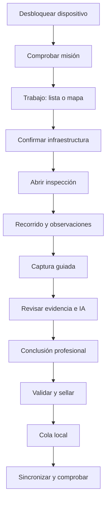

# Requisitos UX/UI para campo

Esta guía convierte los requisitos técnicos y de seguridad en una experiencia
repetible para personal de campo. La interfaz es una herramienta operativa: debe
priorizar lectura rápida, continuidad offline y decisiones humanas explícitas.

## Usuarios principales

| Usuario | Necesidad | No debe ocurrir |
|---|---|---|
| Inspector/a | completar visitas con evidencia y criterio profesional | confundir una sugerencia IA con un dictamen |
| Coordinador/a | asignar zonas y ver avance/pendientes | asumir que “sin red” significa “sin trabajo” |
| Revisor/a | comparar evidencia, versiones y conflictos | aprobar sin conocer fuente, versión o incertidumbre |
| Soporte | recuperar una jornada sin leer datos sensibles | editar silenciosamente una inspección |

El ciudadano, la brigada de rescate y el publicador son flujos separados. No se
agregan a la aplicación de inspector sólo para reutilizar pantallas.

## Navegación estable

La navegación principal tiene cuatro destinos de dimensiones estables:

1. `Trabajo`: lista priorizada de infraestructuras y asignaciones.
2. `Mapa`: cobertura, ubicación y selección espacial offline.
3. `Sincronizar`: cola, progreso, errores y comprobante de cierre.
4. `Más`: evento, almacenamiento, modelo, dispositivo y ayuda operativa.

La barra superior siempre muestra el evento activo, estado de red, cantidad
pendiente y estado del paquete. Ningún estado crítico depende sólo del color.

## Flujo principal

Cada paso se guarda localmente. Volver, cerrar la app o perder batería no obliga
a repetir campos confirmados ni fotos ya validadas.

## Pantallas

### 1. Desbloqueo y preparación

Muestra identidad operativa, evento, última sincronización y botón de desbloqueo.
Después verifica:

- formulario disponible y vigente;
- zona/mapa descargados;
- almacenamiento libre;
- modelo válido o modo sin IA;
- fecha/hora del dispositivo y precisión de ubicación;
- inspecciones pendientes que aún no tienen copia confirmada.

Un problema se expresa como acción concreta: `Descargar`, `Liberar espacio`,
`Trabajar sin IA`, `Corregir hora` o `Contactar coordinación`. No se bloquea una
jornada por una capacidad opcional.

### 2. Trabajo

La primera pantalla útil es una lista densa y escaneable, no un tablero de
mercadeo. Cada fila muestra:

- identificador/dirección corta y tipo de infraestructura;
- prioridad y estado en texto más icono;
- distancia o zona, si está disponible;
- última visita y posible duplicado/conflicto;
- sincronizada, pendiente o sólo asignada.

Controles:

- búsqueda local por código, dirección o referencia;
- filtros por zona, tipo, prioridad, estado y asignación;
- orden por ruta, prioridad o antigüedad;
- alternancia lista/mapa;
- acción clara `Iniciar inspección`.

La posición de las filas, filtros y barra no cambia cuando llegan miniaturas o
resultados. Se usa renderizado virtual para catálogos grandes.

### 3. Mapa offline

El mapa muestra paquete, fecha, atribución y precisión GPS. Un punto de captura
no reemplaza la geometría de la infraestructura. La persona puede:

- centrar su ubicación;
- seleccionar una infraestructura;
- confirmar o corregir el punto con motivo;
- ver sólo la zona descargada;
- cambiar a lista si el mapa no está disponible.

La app nunca descarga teselas sin límite en datos móviles ni presenta un mapa
vacío como si no hubiera infraestructuras.

### 4. Identidad de la infraestructura

Antes del formulario se confirma:

- infraestructura correcta, tipo y uso;
- referencia espacial y precisión;
- visita nueva, continuación o posible duplicado;
- alcance y restricciones de acceso;
- existencia de alerta humana separada.

Crear una infraestructura nueva exige al menos ubicación, tipo provisional,
referencia de campo y motivo. La reconciliación posterior no borra el original.

### 5. Inspección por etapas

El formulario usa secciones cortas con estado completo/incompleto:

1. alcance y condiciones de acceso;
2. tipología y uso;
3. exterior, terreno y elementos;
4. interior sólo cuando sea autorizado y seguro;
5. daños no estructurales y servicios;
6. evidencia;
7. acciones/recomendaciones dentro de la autoridad;
8. conclusión profesional y limitaciones.

Los valores `sin daño observado`, `no observado`, `no accesible`, `desconocido`
y `no aplica` son distintos. La app evita campos obligatorios que fuercen a
inventar una observación.

### 6. Cámara guiada

La cámara ocupa la mayor parte de la pantalla. Los controles esenciales usan
iconos conocidos, objetivos táctiles amplios y etiquetas accesibles.

Antes de disparar se selecciona el tipo de vista: contexto, fachada, elemento,
detalle, terreno o riesgo no estructural. Después de capturar:

- se conserva el original;
- se verifica desenfoque, oscuridad y obstrucción;
- se solicita repetir o justificar una imagen deficiente;
- se relacionan contexto y detalle;
- se registra escala física cuando se pretenda medir;
- se permite anotar sin pintar el original.

La captura no espera a que termine la inferencia. La IA se procesa en cola de a
una imagen y se puede cancelar.

### 7. Revisión de IA

La pantalla compara `Original`, `Sugerencia IA` y, cuando exista, `Ajuste humano`
mediante pestañas o un control de comparación. Debe mostrar:

- modelo/versión en detalle técnico, no como argumento de autoridad;
- estado `no ejecutada`, `procesando`, `disponible`, `fuera de dominio` o `error`;
- máscara superpuesta con control de opacidad;
- acciones `Aceptar como observación`, `Corregir`, `Descartar` y `Sin IA`;
- motivo breve obligatorio para corregir/descartar cuando la política lo exija.

No aparece un gran porcentaje de “seguridad” ni una etiqueta verde de edificio
seguro. La pantalla no convierte área de píxeles en ancho real sin una escala y
un método aprobados.

### 8. Cierre y sello

Antes de cerrar se muestra una lista de verificación:

- secciones incompletas y justificaciones;
- evidencia mínima y calidad pendiente;
- coordenada y precisión;
- sugerencias IA sin revisión;
- limitaciones de acceso;
- conclusión escrita por la persona responsable;
- versión de formulario y credencial.

`Sellar inspección` es una acción deliberada con confirmación. El resumen separa
en bloques distintos `Observado`, `Sugerido por IA`, `Conclusión profesional` y
`Acción autorizada`. Tras sellar, corregir crea una nueva versión.

### Asistente local contextual

El asistente se abre desde una observación o desde el resumen, sin ocupar un
destino principal. Puede buscar una fuente aprobada, señalar campos faltantes y
proponer un borrador. Cada respuesta muestra fuente, vigencia y acciones
`Insertar como borrador`, `Descartar` o `Ver fuente`.

No responde en lugar de la persona, no ejecuta automáticamente herramientas de
escritura y no presenta su texto como diagnóstico. Si el teléfono no admite el
modelo, los mismos controles de reglas y búsqueda textual siguen disponibles.
La marca del motor aparece únicamente en información técnica/licencias.

### 9. Sincronización

La pantalla de sincronización muestra contadores estables:

- registros por enviar;
- originales y bytes pendientes;
- elementos con error o conflicto;
- última confirmación del servidor;
- red actual y si se permiten datos móviles.

`Sincronizar ahora` mantiene la pantalla despierta durante un cierre de jornada,
permite pausar y no confunde `subido` con `revisado`. Al terminar emite un
comprobante local con fecha, cursor y pendientes restantes.

### 10. Almacenamiento y diagnóstico

Presenta barras por categoría: originales pendientes, originales respaldados,
miniaturas, mapas, modelos y otros. Sólo ofrece borrar contenido que la política
permite y explica el efecto antes de confirmar. También muestra:

- nivel IA A/B/C y razón;
- versión de app, runtime, paquete y modelo;
- última migración y estado de la base;
- prueba de cámara, GPS, red y sincronización;
- exportación cifrada de emergencia autorizada.

## Sistema visual

- Diseño sobrio, de alta densidad y sin secciones decorativas.
- Tipografía legible a pleno sol; el tamaño no depende del ancho del viewport.
- Controles táctiles mínimos de 44 x 44 puntos y separación para uso con guantes.
- Texto e icono acompañan severidad, red, sincronización y errores.
- Contraste WCAG AA como mínimo; modo de alto contraste para exterior.
- Rojo se reserva para peligro/error, amarillo para advertencia y verde para
  confirmación de proceso, nunca para declarar habitabilidad.
- Encabezados compactos dentro de paneles y listas; sin tarjetas anidadas.
- No hay animaciones indispensables; se respeta reducción de movimiento.
- Español es el idioma inicial y todas las cadenas son internacionalizables.
- Lectores de pantalla reciben orden lógico, etiquetas y anuncios de progreso.

## Estados que toda pantalla debe soportar

- cargando desde base local;
- vacía por asignación real;
- sin red con datos disponibles;
- sin red y sin paquete requerido;
- error recuperable con reintento;
- acceso denegado por rol;
- almacenamiento bajo;
- formulario/modelo vencido;
- conflicto pendiente;
- datos guardados pero no sincronizados;
- datos sincronizados pero no revisados.

No se usa una pantalla vacía genérica para varios casos porque conduce a
decisiones operativas diferentes.

## Atajos de jornada

- La siguiente infraestructura se puede abrir desde el comprobante de cierre.
- Los valores repetibles de misión se precargan, pero siempre son editables.
- Una observación puede duplicar estructura, no conclusión ni evidencia.
- La cámara vuelve al mismo elemento y tipo de vista.
- Los borradores se recuperan al abrir la app.
- Los filtros permanecen durante la ruta y se restablecen de forma explícita.

## Pruebas de aceptación UX

### Continuidad offline

- Arrancar en modo avión y completar 20 inspecciones sin pantalla bloqueante.
- Cerrar la app durante foto, formulario, sellado y sincronización; recuperar sin
  pérdida ni duplicados.
- Reiniciar el teléfono y encontrar misión, borradores y cola.

### Teléfono limitado

- Ejecutar en nivel C y completar exactamente el mismo formulario.
- Alcanzar almacenamiento bajo: detener descargas costosas, no perder capturas.
- Alcanzar temperatura alta: pausar IA, conservar cámara y texto.

### Integridad

- Interrumpir una carga repetidamente y verificar un solo original por hash.
- Recibir una versión del servidor y resolver un conflicto de conclusión.
- Detectar posible infraestructura duplicada sin fusionarla automáticamente.
- Intentar editar una inspección sellada y crear sustitución versionada.

### Seguridad humana

- Mostrar una máscara errónea y verificar que puede descartarse sin fricción.
- Usar una imagen fuera de dominio y no presentar dictamen.
- Registrar `no accesible` sin obligar una severidad.
- Abrir una alerta de persona/hogar y comprobar que no aparece en exportación
  técnica ni mapa público.

### Entorno real

- Uso bajo sol, lluvia simulada y guantes en el teléfono de entrada.
- Lectura por pantalla, aumento de texto y alto contraste sin superposiciones.
- Catálogo de 10.000 infraestructuras con búsqueda, filtros y mapa estables.
- Cierre de jornada con conexión intermitente y comprobante de pendientes.

## Métricas de UX del piloto

- tiempo mediano y p95 por inspección y por foto aceptada;
- pasos repetidos por pérdida de estado;
- errores de infraestructura equivocada o duplicada;
- fotos repetidas por calidad y tasa de justificación;
- sugerencias IA aceptadas, corregidas, descartadas y fuera de dominio;
- inspecciones selladas con campos desconocidos/no accesibles;
- tiempo hasta respaldo confirmado y bytes pendientes al cierre;
- fallos de accesibilidad, toques erróneos y abandono por pantalla.

Estas métricas alimentan la decisión de soporte y no se convierten en metas de
velocidad que incentiven omitir observaciones o revisión.
