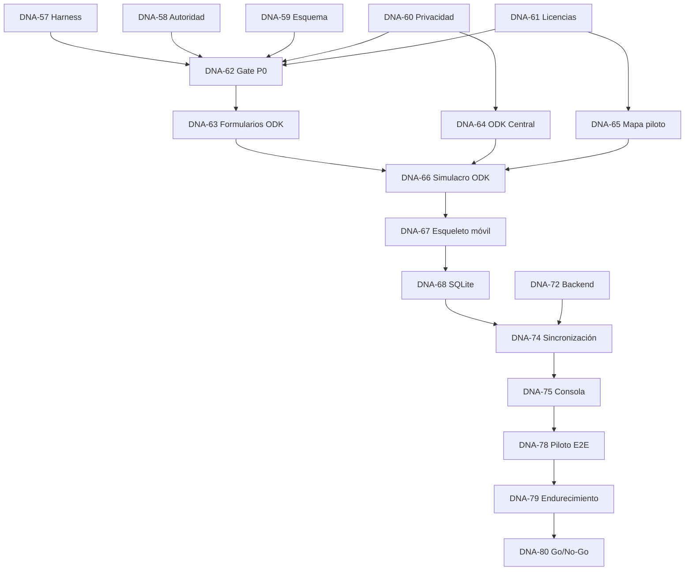

# Task Graph

## Hitos

| Hito | Resultado |
|---|---|
| M1 Gobierno y harness | OpenSymphony operativo y ADRs P0 aprobadas |
| M2 Piloto ODK | Flujo de campo medido antes de construir toda la app |
| M3 Núcleo móvil offline | Captura, datos, mapas, IA y sync local |
| M4 Consola e informes | Backend, revisión, población e informe verificable |
| M5 Validación territorial | Simulacro, endurecimiento y decisión go/no-go |

## Camino crítico

## Regla de despacho

Sólo `Todo`, `In Progress` e `In Review` son estados activos para el harness.
Las tareas de implementación permanecen en `Backlog` hasta que una persona
confirme que sus dependencias y aprobaciones están completas.
